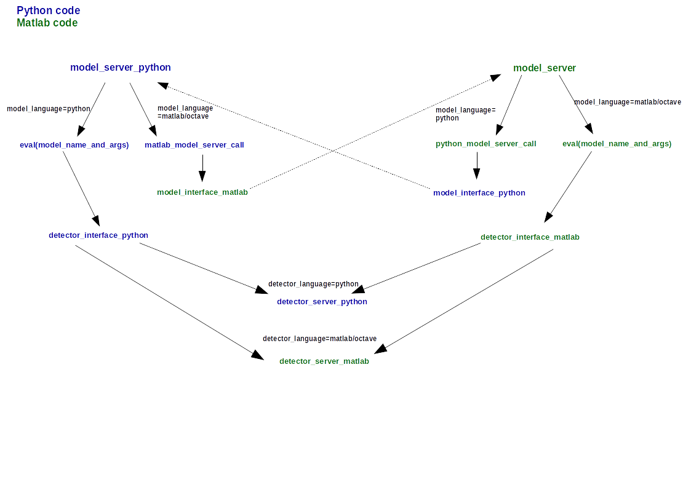

# README #
## Version 0.1
For a quick start with Matlab see quick_start.txt and quick_example.txt in the *model_initiative* folder.


## Introduction

This document aims to describe how to use matlab/octave and/or python to launch auditory pathway
models and detectors in the context of a model comparison framework described in more details below.


\
*A: Classic experiment in psychoacoustics B: Structure of the model comparison framework: models process
the sound files generated by the experiment side. The output of the model is then fed to the detector which comes up with a decision.*

From the figure below two sides can be observed: the experiment side and the model/detector side.

## Launching the experiment side
The experiment side is in charge of generating the sound files (.wav) located in the *fileexchange* folder which will then 
be processed by the model side. 
Launching the experiment side requires a couple of matlab toolboxes (note that they are not all mandatory for a quick start):
* the AFC toolbox can be found at: http://medi.uni-oldenburg.de/afc/
* the AMT toolbox development version can be found at: https://sourceforge.net/p/amtoolbox/code/ci/master/tree/
* the binaural cross-correlogram toolbox by Michael Akeroyd (not currently available but also not mandatory to run most experiments)

### Setting up the AFC toolbox

The easiest way to set it up is probably to uncompress the afc folder after downloading it and copy/paste
it in the main *model_initiative* repo (ie where the other folders *model_server*, *fileexchange*... are).
You can now open a matlab instance, navigate to the main *model_initiative* folder and run the
```model_initiative_init_experiment```
script to add the necessary paths to the matlab path. Then run ```AFC_init```.
After that navigate to the *afc* folder and run the ```afc_addpath``` script.
After that, you can run for instance the following:

```afc_main('KleinHennig2011','ModelInitiative','identifierXY','4');```

The available afc experiments are located in the */experiments/afc* folder.

### Setting up the AMT toolbox 
Download the latest version, place the uncompressed folder in the *model_initiative* folder.You can now open a matlab instance, navigate to the main *model_initiative* folder and run the ```model_initiative_init_experiment``` script to add the necessary paths to the matlab path. Then follow the instructions provided in the *readme* files in the *thirdparty* folder of folder to install *ltfat* and *sfs*.Then add the *amt*folder to your matlab path and run the ```AMT_init``` script to set up AMT. The AMT toolbox is needed if the user wants to run the Breebaart 2001 model and detector. AMT can also run experiments. For instance: ```exp breebaart2001('bfig3','redo','BInit','directory',simwork.iopath);```
if this error occurs : 
*Error using ltfatarghelper
[ERROR] (../../mex/ltfatarghelper.c:491:) struc is NULL*, please close matlab, go to *ltfat/mex* and delete the file *ltfatarghelper.mexw64*. You can then restart matlab and things should work.
 

## Launching the model/detector side

Comparing different computational models can be challenging when models are written in different 
languages. The model_initiative library addresses that issue by allowing the user to launch matlab/octave
models and detectors as well as python models and detectors from a common command line (either matlab
or python command line). The main idea behind that is to create threads in which models and detectors
run. These threads are created and closed automatically when the user runs either the *model_server* matlab
function or the *model_server_python* function. Because the way to launch matlab,octave or python threads
varies with the platform that the user runs (Windows, MacOS, Linux), some small editing/configuring might
be necessary to use the library. These edits will be explained further in the following subsections.

### Minimum requirements for the matlab user

* Matlab, above R2013a

To run python examples, the python requirements must be satisfied as well

### Minimum requirements for the octave user

* Octave above 4.0.0
* Packages nan,statistics, signal, control, io 
  - https://octave.sourceforge.io/control/
  - https://octave.sourceforge.io/io/
  - https://octave.sourceforge.io/nan/
  - https://octave.sourceforge.io/signal/
  - https://octave.sourceforge.io/statistics/

### Minimum requirements for the python2 user

* Python 2.7
* Recommended to run most available python model and detector examples:
  - Brian: http://briansimulator.org/
  - Brian2: https://brian2.readthedocs.io/en/stable/

Both libraries should be installed to guarantee full functionality. To run matlab examples, matlab
requirements must be satisfied as well.

### Set up and configuration depending on the user’s OS
The model and detector threads are launched from the *python_model_server_call.m*, *matlab_model_server_call.py*
and from the *detector_interface_python.py* and *detector_interface_matlab.m* functions located in the *model_server*
folder(see call graph below).

* For Windows users: If you want to use Octave, you might have to add to your PATH environment
variable the bin folder of the Octave library. Once this is done, everything should work normally. To
do so please follow the instructions:

1. Go to the Windows Start Menu
2. Right Click ”Computer”
3. Select ”Properties”
4. A dialogue should pop up with a link on the left called ”Advanced system settings”. Click it.
5. In the System Properties dialogue, click the button called ”Environment Variables”.
6. In the Environment Variables dialogue look for ”Path” under the System Variables window.
7. Add ```;C:\Octave-4.0.0\bin``` to the end of it. The semicolon is the path separator on windows.
8. Click Ok and close the dialogues.

* For Linux users: Matlab runs bash commands using its own version of libstdc++, that version might
be incompatible with the one that exists on your system. A fix to it is to export to your library PATH
the path to the directory where the libstdc++.so.6 file is. On many computers that path is located in
the directory ```/usr/lib/i386-linux-gnu``` . If on your computer that path is located somewhere else then
please edit the *detector_interface_matlab.m* and the *python_model_server_call.m* and change the path
in all commands starting with ```export LD_LIBRARY_PATH=/usr/lib/i386-linux-gnu``` with your own
path. Everything else should work well after that change.

* For the MacOS users: it is assumed that Matlab and Octave were installed by the user in the *Applica-
 tions* folder (default folder used by MacOS when software is installed). The matlab and octave binary
 files are not directly callable from the command line. To change that, a couple of symbolic links must
 be set up.

  - For matlab: Open a terminal window, from there type:
 ``` sudo ln -s /path to your matlab bin /usr/local/bin/matlab ```
  The matlab binary file is usually located at */Applications/MATLAB RXXXX/bin/matlab* where
  XXXX is the version of matlab.
 
  - For Octave: Open a terminal window,from there type:
 ``` sudo ln -s /path to your octave-cli-XXX bin /usr/local/bin/octave-cli ```
 Usually, the octave-cli-XXX binary file is located at:
 */Applications/Octave.app/Contents/Resources/usr/Cellar/octave/X.X.X/bin/octave-cli-X.X.X*, where
 X.X.X is the version number.

## Quick description of the organization of the library
* *fileexchange* folder hosts the different files that are exchanged between the experiment side, the model
side and the detector side.
* *pathway_model* folder stores the available models written in any language (matlab,octave or python).
* *decision_stage* folder stores the available detectors written in any language.
* *Experiment* files (either AFC, AMT or your own) can be found in the experiment folder.
* *model_server* folder stores the matlab and python function used to interface experiments, models and
 detectors (see call graph).
* *data* folder stores the results produced on the experiment side.
* *plot* routine folder contains a set of function to plot the results store in the data folder.

## Quick start
Once the requirements are satisfied, assuming the experiment side is already launched:

### For the matlab/octave user
1. Open a matlab/octave desktop
2. Navigate to the main folder of the library and run the ```model_initiative_init_model``` script
3. Run the model server matlab function with the right set of arguments.
*model_server(no_intervals,model_name_and_args,detector_name_and_args, model_language,detector_language)*
If the model and the detector are both in matlab, there is no need to precise the detector language,
just use:
``` model_server(2,'klein_hennig_2011(wave,fs,0.18,0)','argmin(pathway_out)','matlab')```

however if the model and the detector are written in different languages use for instance:

``` model_server(2,'klein_hennig_2011_python(wave,0.18,None)','argmin(pathway_out)','python','matlab')```
or
``` model_server(2,'klein_hennig_2011(wave,fs,0.18,0)','argmin_python(pathway_out)','matlab','python') ```
or
``` model server(2,'goodman_brette_2010_python(wave,20,0.05)','argmax_python(pathway_out)','python','python')```

### For the python2 user

1. using a command terminal, navigate to the *model_server* folder
2. From there run for instance:
```python -c "from model_server_python import model_server_python; model_server_python(2,'klein_hennig_2011_python(wave,0.18,None)','argmin_python(pathway_out)','python','python')" ```
or
```python -c "from model_server_python import model_server_python; model_server_python(2,'klein_hennig_2011(wave,fs,0.18,0)','argmin_python(pathway_out)','matlab','python')"```
or
```python -c "from model_server_python import model_server_python; model_server_python(2,'goodman_brette_2010_python(wave,20,0.05)','argmax_python(pathway_out)','python','python')"```

You can also check the available detectors and models by running the ```check_available_detectors``` and
```check_available_models``` function located in the *model_server* folder. Note though that all detectors will not
work with all pathway models (see table in appendix)

## Features to be aware of

### Choice of model and model arguments, detector and detector arguments
Amongst the arguments of the model server function, two of them are of particular importance:

* *model_name_and_args* refers to the name of the chosen model and the set of arguments chosen by the
user to run the model with. The first argument should always be *wave*, which refers to the dual channel
sound array. Matlab pathway models often require the samplerate as argument. Use *fs* to refer to the
samplerate and place it at the second position in the argument list.

* *detector_name_and_args* refers to the name of the chosen detector and the set of arguments chosen
by the user to run the detector with. The first argument of the detector function should always be
*pathway_out*.\
*pathway_out* is the name of the structure that the pathway model output. If the model is in matlab,
*pathway_out* is a cell.

### Model language and detector language arguments

When the ```model_server_python``` function is used to call the model and detector, the model language and the
detector language must be provided as the two last arguments of the function. The different choices the user
can pick are : *matlab*,*octave* and *python*.
When the ```model_server``` (ie the matlab/octave model server) function is used to call the model and
detector, only the model language field is mandatory if both model and detector are both run with the same
language (matlab or octave). If the model and the detector are written in different languages or if they are
both written in python then the detector language should be provided as well.

## Call graph


## Contributing
If you would like to contribute to the project by adding experiment, model or detector scripts, please check out the *theinterface.pdf* document in the *model_initiative* directory for more technical information on how to do so.

## Contact
If you have any question regarding the project, or the matlab part of the code,  please contact Mathias Dietz at : 
mdietz@uwo.ca

For any question regarding the python part, please contact Jean-Hugues Lestang at:
j.lestang15@imperial.ac.uk

## Appendix
### Table of compatible experiments/models/detectors


